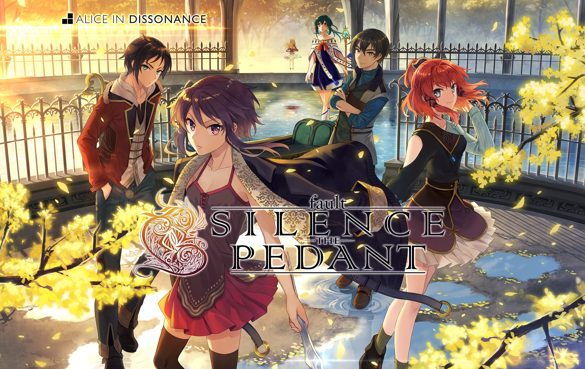
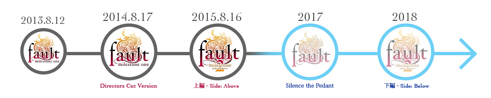
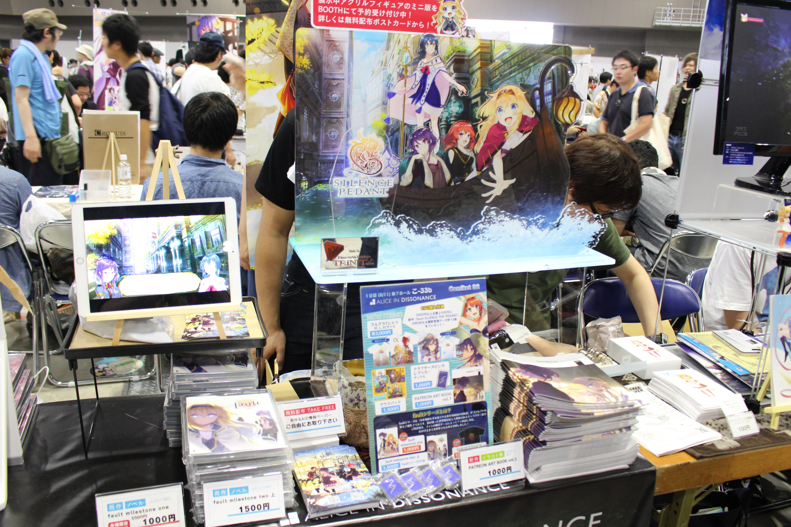
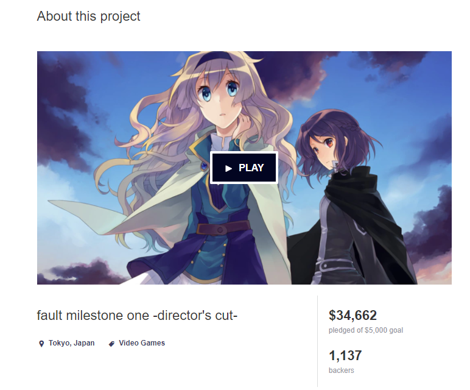
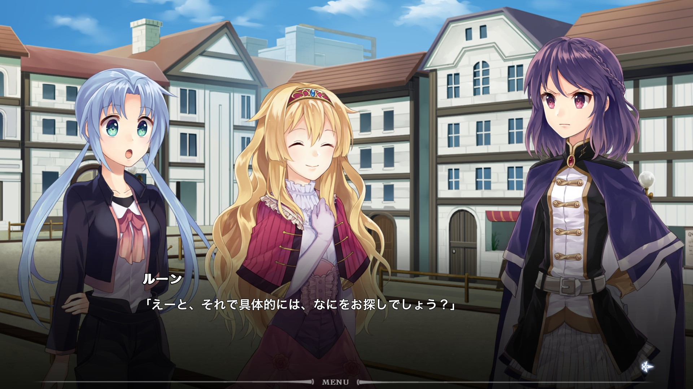
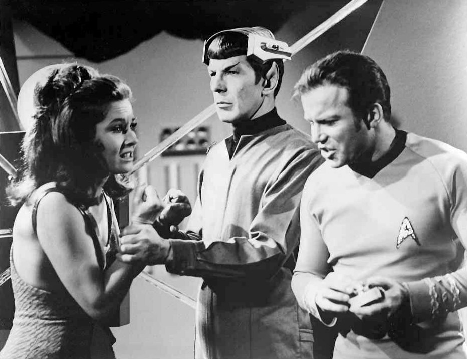
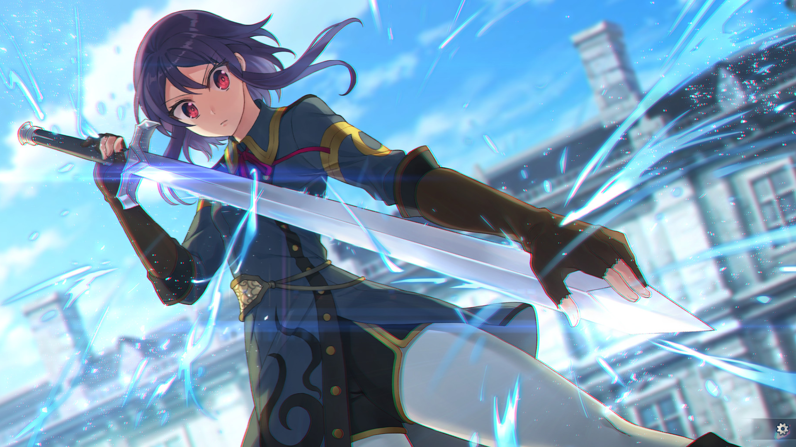
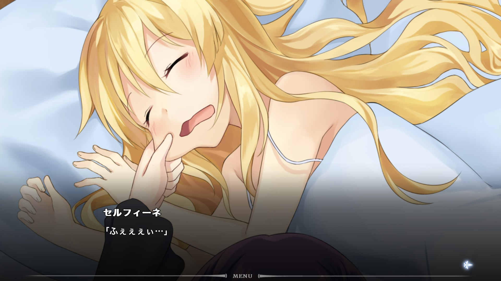
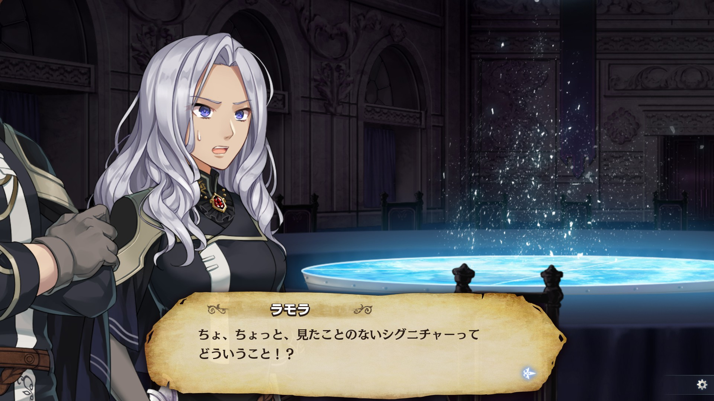
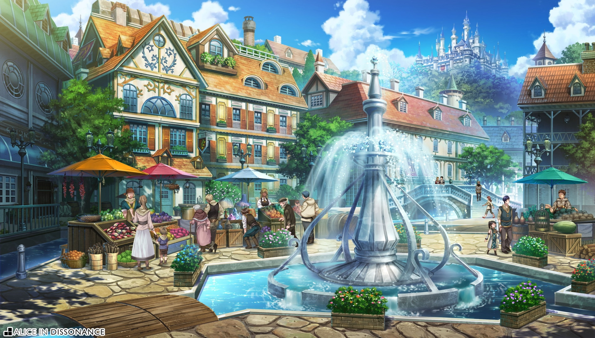

---

Published: 2019-01-08

---
## **Interview With the Developers of** **_fault_****, the Hit Indie Visual Novel Series That Sold 300,000 Copies**

_Original interview source:_  [_http://jp.ign.com/fault-stp/18989/interview/30fault_](http://jp.ign.com/fault-stp/18989/interview/30fault) _(November 5, 2017)_

_Translated, edited, and formatted w/ additions and changes by Jerico Tenmatay_ [_@jbtenmatay_](https://twitter.com/jbtenmatay)

_Proofread and edited w/ additions and changes by Munisix_ [_@projectwritten_](https://twitter.com/projectwritten)

_\[Note: TL notes and minor additions and clarifications in square brackets\]_

## **A fantasy series brought to life thanks to "Star Trek"**　

Visual novels are very popular nowadays. One would think that this notion is ridiculous because this unique brand of PC gaming culture from Japan is considered niche even in the country itself. However, its style and aesthetic have garnered a passionate fanbase and eventually made its way overseas.

Visual novels were first sold on Steam, a digital marketplace, in 2012 with the release of _Analogue: A Hate Story_ by Christine Love. It is a primarily text-based adventure game incorporating ideas from the visual novel genre, such as strong two-dimensional female characters and a gripping and interesting story.

In the same year, a free and open-source visual novel, _Katawa Shoujo,_ was released by an international team from the message board, 4chan. This game features female characters who each has a particular disability. Normally, tackling subject matters such as these would be considered "taboo" but its sincere handling of the story and high-quality production values won the hearts of many readers. There since have been countless other creators who are active in the overseas visual novel development scene.

Below are other examples of the increasing popularity of visual novels over the past 5 years:

In 2014, the short and easy-to-digest _Sakura Spirit_ was released to similar success. _Nekopara_ by NEKO WORKs was also released in the same year -- it features animated sprites that made it a big hit. It was also around this time that classic Japanese visual novels _CLANNAD_, _Muv-Luv_, _Higurashi no Naku Koro ni_ (_Higurashi When They Cry_) were localized and released on Steam thanks to the efforts of localization and publishing companies such as Sekai Project and MangaGamer.

Now in 2017, visual novels are not as wholly inspired by Japanese culture as it once was. It is still a niche genre but there are also fans who look for visual novels with the story as the primary focus. Visual novels are starting to diversify and with that in mind, I'm here with ALICE IN DISSONANCE (AiD), developers of the _fault_ series.

_fault_ is an episodic visual novel series created by ALICE IN DISSONANCE in 2013. It is a story about the adventures of Princess Selphine and her guardian, Ritona, set in a fictional world centered around the Kingdom of Rughzenhaide. It focuses on fantasy, with an arte called "Manakravte" as a key aspect of the world. It also incorporates the elements and aesthetics of sci-fi and steampunk. Two episodes have already been released ([_fault - milestone one_](http://store.steampowered.com/app/286260/fault__milestone_one/) and [_fault - milestone two side:above_](http://store.steampowered.com/app/344770/fault__milestone_two_sideabove/)_)_ following the two heroines as they are thrust into an unfamiliar world and face challenges thrown at them.

It features a camera system that enables sophisticated cinematic effects and has been translated into multiple languages. The series has sold more than 300,000 copies, a surprising number considering it is developed by an independent group, proving its popularity in the visual novel scene.

_fault - SILENCE THE PEDANT (StP)_, a prequel, is set to release in late 2017. It sports gorgeous visuals, an evolution on the cinematic camera system, and a newly introduced point-and-click interface. I had the opportunity to go to this year's Comic Market (Comiket) to meet the creator, Munisix. I played the demo and was impressed by the quality that I played through it all in one sitting. With the release of _fault - milestone one_ overseas for the Sony PS4/Vita around the corner, I can't help but be more excited for what they can do next. I would like to present in this 2-hour interview about what makes the series different and why _Star Trek_ became its primary influence, among other topics.

## **A man born and raised in America who came to Japan to pursue making visual novels.**

**\--- Nice to meet you. First of all, could you please introduce yourself.**

MUNISIX (M): I'm Munisix, figurehead, director, and scenario writer of AiD. I was born and raised in California in the United States. And I came here to Japan 2 months before the 2011 Tohoku earthquake to make games.

**\--- You didn't come back to Japan as a returnee** **_\[TN: someone born in Japan but was raised outside Japan\]_****?**

M: No. I grew up in America then came here when I was 25. I'm 32 now.

**\--- Did you come here to make games?**

M: Yes. At the time, all I wanted to do was to make _fault_ a reality so I came here to Japan.

**\--- Wow, impressive! That's hard to believe.**

M: (laughs) Well... I wanted to put a stop to my boring everyday life. I knew it was going to be a wild ride but I felt like I could manage it.

**\--- Then why did you come to Japan? You didn't have to go to Japan in order to make games.**

M: I decided to make visual novels and if I wanted to pursue that aesthetic, I needed to go to Japan and interact directly with artists and creators. I also wanted to know more about Japanese culture; both my parents are Japanese, but since I was raised in America, there were a lot of things about it that I didn't understand. What's their sense of humor? What's popular? What sells? I wanted to know more about that.

**\--- Have you played visual novels when you were in America?**

M: I watched anime growing up. I have also played visual novels and eroge (18+ VNs). I found making stories interesting so I wanted to try my hand at it.

**\--- So you were aware that Japan was the place to be for VNs and the like?**

M: Yes. It was around the time _Higurashi no Naku Koro ni_ was finally getting an anime adaptation. It made me want to participate in Comiket which I previously thought wasn't possible.

_\[fault - SILENCE THE PEDANT\] Key Visual_

**\--- That's an interesting mindset. How about you, Hare-****_san_****, would you kindly introduce yourself.**

Hare Konatsu (H): My name is Hare Konatsu, artist and art director of AiD. I'm in charge of illustrations, graphics, UI Design. As the art director, I'm responsible for making the character sprites being shown in the games. I wanted to make at least one visual novel so I joined AiD when MUNISIX was recruiting for artists. Before joining AiD, I have only done art for fan magazines (_doujinshi_) so I wanted to do something new. I didn't want to do school settings so I looked for those that didn't and eventually came across _fault._

**\--- What made you join AiD?**

H: Munisix also didn't want to do any school settings, and he has other skills as well. He can write stories and make movies. He's a real pro at the latter. I was taken in by it.

**\--- Sounds like you have high expectations.**

H: I suppose. (laughs)

**\--- Have you also recruited other people besides artists?**

M: I only looked for artists and programmers. For the programmer though, there wouldn't be any point recruiting if the story isn't finished yet so I did that first.

**\--- I see what you mean.**

M: I already had the general outline of the story. I was thinking maybe I can get it published as a manga. But I figured I have to finish at least something on my own so I have an idea how to do that in the first place.  I wanted it to be a learning experience since I haven't finished anything yet.

**\--- How did you manage to earn a living after you moved here?**

M: When I was still in America, I worked as part of a small film production company. We made commercials and internet videos. It was there that I learned how to edit videos and the basics of storytelling. Once I quit my job and moved to Japan, I continued working as a freelancer. Unfortunately, at the time, the conversion rate was 1USD to 70 Yen and all my income was in USD. It was quite a tough time.

## **Series plan for Steam and Kickstarter success!**

_Release roadmap published at the_ [_official site_](http://projectwritten.com/fault-series/)

**\--- Now that I look at it, it seems like you guys really stick to your release schedule.**

M & H: Oh no. Not at all! (Laughs)

**\--- Is that so? Other indie (****_doujin_****) circles don't usually have a roadmap this planned out. Also, I think that attaching "Milestones" (ie.** **_milestone one_****) to your titles is a neat idea. Did you have a specific reason to use that naming scheme for the episodes?**

M: There's a lot of pertinent background details in the story but I already decided on an ending when I was plotting out the series. So even if it doesn't sell, it'll be fine. Because of that, it gives me the freedom to extend the middle part for as long as I feel like it. I also planned it to be flexible right from the start so I can decide when to end it if needed.

**\--- How was it for you when the series began?**

M: It was in the summer of 2013 when I finished _fault -_ _milestone 1_. I participated in Comiket about half a year later. Then, Sekai Project approached me. By the end of 2014, it was released on Steam. At first, the Kickstarter campaign was there only to fund the localization. The goal was US$5,000 but by the end of it, we ended up getting 8 times that so we were able to do so much more than just that.

  
_AiD booth in 2017 Summer Comiket. Despite the games being released on steam, they go the extra mile and show up at events for doujin works in Japan._

**\--- How was your booth received at Comiket?**

M: We weren't expecting big numbers compared to the big and famous names but as a newly established indie circle, it's not too bad. I think we sell about 150 copies every time we go. You can’t make a living on it though. (laughs)

**\--- Were you surprised that Sekai Project approached you?**

M: Definitely. Especially when we realized that Chris, Raymond (from SP) and I, were all from the same area -- Irvine, CA and the 626 area in Los Angeles. (laughs) I think it's because of that we were able to get along pretty well. They also very gracefully structured the Kickstarter campaign in such a way where even if it failed, there would be no large burden to us. We were a no-name _doujin_ circle at the time and we didn’t really have much to lose so we decided to give it a shot with them.

**\--- What do you think was the reason for the Kickstarter's success?**

M: I'm not really sure but if I were being honest, it may be because I can speak English. When questions came in from fans, I could answer them directly as the developer. It was tough though, I could barely sleep interacting with people during the 30-day period of the campaign.

  
_The Kickstarter campaign for the localization and Director's cut version raised 34,662 USD_

**\--- That sounds quite an exciting time. It's like you struck out at the right moment.**

M: It was. We got lucky. Everything fell into place with that Kickstarter campaign. The expectations weren't that high yet and the success gave us confidence that “we can do this”.

**\--- Are you letting Sekai Project handle the localization? \[****_TN: Primarily EN._****\]**

M: There was a lot of back and forth but in the end, yes, they will do all of the translations. We met someone who can faithfully capture the tone and feel of the text.

**\--- You could oversee it yourself since you can read English, right? Couldn't you just write it all in English?**

M: Somehow, that wasn't on my mind. (laughs) It’s probably because the idea of wanting to do storytelling came to me in Japanese.

**\--- Because you already learned how to write stories in Japanese?**

M: Yeah. I already had a feel for the pacing and tempo. That was only the beginning though. Lately, I’ve been learning from multiple facets of entertainment. I’ve thought about rewriting the whole thing in English but it would take so much time.

**\--- It would be quite a challenge to write everything again in English.**

M: Indeed. I just don't have a feel for it. I'm not really a “Western _otaku_” since I could just understand the original content and that makes me hesitate as I wasn’t really a part of that scene.

**\--- That's interesting. You're right. We may all be** **_otaku_** **but the English-speaking world, in particular, has their own culture and tastes. How about you, Hare-****_san_****? How do people overseas view your work?**

H: There are a lot of Japanese-style games on Steam nowadays but that wasn't the case before. I wasn't sure if my style would be well-received in a market dominated by more realistic styles. But now I receive feedback from a lot of people through Discord and other social media sites. My English isn't very good but I am slowly becoming able to interact with fans and read their comments. There are a lot of anime fans overseas and I'm glad to know that many of them are fans of us.

**\--- I think by this point, you're at a good spot. Do you just go and release titles on a regular pace now?**

M: Not really. It's still a lot of hard work. I don't want to release the same thing every time so I want the next game to be one step higher in quality. This next one, _fault - SILENCE THE PEDANT_, is our biggest one yet and I’m still learning a lot about budgets and manpower needed to pull off something like this the hard way.

**\--- So for** **_fault - SILENCE THE PEDANT_****, did you outsource some of the work overseas and hire more staff?**

M: We have added 1 more core member. He used to work part-time for us and he’s officially become a part of the team since _fault SILENCE THE PEDANT_. Any income we get from sales goes back into production. We're really fortunate that we got in a good relationship with a studio that does background art. I don’t really like talking about sales figures and numbers in public but when you tell people that you sold several hundred thousand copies, you tend to get their full attention.

**\--- So this is now your group's main source of income?**

M: It is.

**\--- So far, the entire series has sold over 200,000 copies, hasn't it?**

M: Yeah. On Steam alone, it's 200,000. If you add in the bundles \[_TN: Humble bundle, etc._\] and factor out keys that haven't been activated, it's about 300,000. (Editor's Note: After this interview, AiD put up an official announcement that they have sold over 300,000 copies.)

https://twitter.com/projectwritten/status/920244775089070080

**\--- What's the ratio between sales in Japan and Overseas?**

M: I'm not sure. I think about 5% comes from Japan so that's not a lot and it's been that way for a while. A good percentage comes from America and China.

H: Especially China.

M: There are Chinese fans from our [Patreon](https://www.patreon.com/fault) (A funding platform to support creators) who loved the series so much that they assembled a team and started to localize the game into Simplified Chinese. They were all university students and worked really hard, making sure it was good, that it (translation, QA, and all) was done in a short amount of time. We then patched that into the Steam release and Chinese sales overtook sales in US almost overnight. The Chinese fanbase rocks!

H: It was amazing seeing the reviews come. Even now, a few still trickle in. They all came in all at once with the Simplified Chinese release. Before there were always requests for a Chinese language release.

M: Then after that, we wondered how we can make that much of an impact in Japan. But eventually, we figured it will work itself out so we don’t stress too hard on it. (laughs)

## **A fantasy world influenced by Star Trek**

  
_fault - milestone one's core theme is interaction with foreign cultures_

**\--- All right. I have an impression that you guys are shockingly unknown here in Japan. Do you think there's any reason for that?**

M: I have no idea. (laughs) We’d do something about it if we did.

**\--- In other words, it sold exceptionally well overseas. Of course, it goes without saying that fantasy is popular in Japan but the themes are very light and it usually focuses on comedy and parody. And then there's** **_fault_** **that goes against the grain. Was there something in the mainstream culture that inspired you?**

M: Yeah. Actually, I binged on a ton of _Star Trek_ before I started _fault_. It was after I came to Japan. I watched the entirety of the _Star Trek_ series and it left a deep impression on me. It made me want to write fantasy or sci-fi fantasy. I wasn't sure which so I flipped a coin and that's how I ended up with fantasy and started planning _fault_. _Star Trek_ was originally a niche series but it became massively popular and now it’s once again a part of mainstream culture. So with _Star Trek_ as my inspiration, I aimed for that.

**\--- How about for Japanese visual novels?**

M: It was a few years before I got into _Star Trek_. The one that stuck out to me back then was _CLANNAD_. Playing it inspired me to write stories then I came across _Star Trek._ (laughs)

**\--- you came across** **_Star Trek_** **in Japan? (laughs)**

M: Sounds kinda crazy, doesn't it? (Laughs)

_Star Trek: The Original Series. Created by Gene Roddenberry, it eventually became synonymous with American Sci-fi Pop Culture_

**\--- Now that you mention it, _fault_ does have a** **_Star Trek_****\-like vibe to it. I can see the influence from when we talked about** **_fault_****'s core themes, that it was an adventure where they meet people from different cultures.**

M: Right. There's more I can add to that as well.

**\--- About the theme, was some of it inspired by your experience coming here?**

M: Maybe, on a subconscious level. I wasn't really thinking about it like American vs. Japanese culture. _Star Trek_ handled solidarity in spite of different and varied cultures in such a cool way that it inspired me to start writing. So when I came to Japan, I didn't really experience any culture shock. Rather, I may not have been conscious of it.

**\---** **_fault_** **is a mix of fantasy, sci-fi, and steampunk. The ideas and worldbuilding feel quite profound.**

M: I didn't want to make a generic fantasy world especially one that uses the word, "magic". So instead, I went with another word to represent it, “kravte”, which has underlying connotations to it. I thought of various small details here and there as I was crafting the world.

_The art of using mana, “kravte”, is one of the key concepts in the series_

**\--- So the storytelling is grounded in the worldbuilding?**

M: Yes. There had to be a detailed framework of how the world works or else I wouldn't have any idea of how the characters behave in it.

**\--- I personally like fantasy. I am what you call a “Setteichuu” \[****_TN: someone that is highly intrigued in worldbuilding even when it doesn’t necessarily have to do with the actual plot_****\]. But with so much intricate detail I imagine it’s hard for casual folks to get into it. Nowadays, fantastical themes are always light in tone and not too sophisticated yet you wanted to focus on the worldbuilding.**

M: I'm not familiar with recent Japanese fantasy works but when I write I try my best to resemble this world in one way or the other. I get that fantasy is a means of escape from reality but I don't like it when the world contains elves and orcs. I'm not fond of medieval worlds that feature magic, heroes, and dragons. I want to make worlds that make sense.

**\--- So you want something closer to the present or maybe something before the Industrial Revolution?**

M: That or something that begins right at the start of the information revolution.

**\--- All right. I want to ask you something, Hare-****_san_****. You mentioned before that you're not fond of school settings. Why is that?**

H: What I don't like about those settings is that they follow the same template. You'll always end up drawing nothing other than school uniforms. There's no variation. I like worlds that I can lose myself in. If I wasn't into the worldbuilding, it would be hard to keep motivated drawing for it. I love fantasy but, like Munisix, I'm also not into high fantasy settings where dragons exist. If given a choice, I like to draw worlds that are kinda similar to real life like _Pokemon_.

**\--- Do you design the characters based on Munisix's vision of the fault world?**

H: Munisix provided me rough sketches that he drew for Selphine and Ritona, the main characters. For Ritona especially, there were precise details that needed to be followed like the hairstyle, etc. so I based my design off of it. For Selphine though, I had free reign because only her personality, among other things, has been decided for her.

**\--- How about the costumes?**

H: I thought about referring to medieval designs as well those during both World Wars. I took some designs as reference and considered if they were appropriate for battle situations; for example, skirts would feel strange to move in during a real battle. I kept those points and how they fit in the _fault_ world in mind for my designs.

**\--- On that note, who do you enjoy drawing more? Selphine or Ritona?**

H: Hmm, I think it would be Selphine. She's very expressive and cheerful, unlike Ritona who always has a sour look on her face. Her expression doesn't change a lot. So personally, I find drawing Selphine more fun.

M: Ritona's design was inspired by Kurapika from _Hunter X Hunter_. He has that grouchy and androgynous vibe.

**\--- I think these kinds of Protagonists are quite rare. You have Ritona whose cool and calm personality can pass as either a guy or a girl. On the other hand, Selphine has multiple facets to her character.**

M: This was intentional. I was careful not to have them fall into a trope-y stereotype like you see in anime. Say, for instance, a character who likes bananas loses themselves whenever they see one. I'd rather have more realistic characterizations.

  
_Princess Selphine, receiver of Path-down, a kravte exclusive only to royalty wherein memories from past generations of rulers can be passed down to their heirs. \[image from fault - milestone two side:above\]_

**\--- So you went with more vivid characterization instead. In** **_fault - milestone two side: above_****, Selphine underwent a sudden and dramatic personality change.**

M: I'd like to think that we'll finally explore more about her in _fault - SILENCE THE PEDANT_. Because so far, the only intriguing point about her is her being completely taken over by Rhegan.

H: She hasn't had her time to shine in _fault - milestone one_ and _fault - milestone two side:above_.

M: It’s because I had a specific manga structure in mind.

H: She's still a character that needs to be built up.

**\--- I may be repeating myself here but I want to ask why you want to try something new in the visual novel style. Did you have new ideas and processes in mind?**

M: Not at the time, no. What I mean is when I quit my job, I wanted to try and make a role-playing game. I already had the setting, did some location research, and started on the story. But it didn't work out. I also realized that I really wanted to focus on the storytelling more. Also, visual novels tend to have the least amount of hurdles you have to overcome to make.

**\--- I see. In the website, you pitched** **_fault_****'s concept as “a** **_shounen_** **manga-style adventure story with female protagonists”. Can you explain what that means?**

M: Putting it simply, they are by far the easiest stories to get into. You have to follow the trend but mix the formula up just a bit. I guess it's not as apparent yet because it's still too early but the story leans into darker themes. _Shounen_ manga has good things going for it but it can be tame at times. So I would like readers who want something new to come into this story and discover the twist.

**\--- Right. So it's a darker and more serious take to the** **_shounen_** **manga formula?**

M: That is something I'm hoping to pull off when it comes to that point.

## **Overseas influence in the development of visual novels.**

**\--- That reminds me, are you still using the Ren'Py engine?**

M: Yes, we’re using Ren'Py. Everyone else was using Kirikiri so I wanted to do something different. (laughs) I wanted folks here to wonder what engine was being used. When we first started using it, we were feeling out what we could do because that was one of the only visual novel engines that we could develop cross-platform at the time. But I'm wondering if we should keep using it for future titles. I feel as though we’ve reached its limit when we started to use 4K assets so we're planning to slowly transition our development to Unity.

**\--- Ren'Py was developed in the West so I imagine it's popular with English-speaking developers, thus leading to visual novel development community rapidly expanding.**

M: There is indeed a boom happening in the genre. And it's becoming more mainstream now that it is being sold in stores such as Steam. So you can imagine people wanting to get in on that. Back then in America, people treat visual novels as a niche within a niche.

**\--- I guess you get told, "Is that a game?" all the time. I got interested in Ren'Py at around 2013 when I came across** **_Juniper's Knot_** **and** **_Dysfunctional Systems_** **by Dischan.**

M: Those were great. _Dysfunctional Systems_ got canceled once but it's back up again. I felt as though their quality was unprecedented in the English Visual Novel scene and it gave me a lot of inspiration so I was shocked to hear that they feel off the face of the Earth. I suppose when you raise to bar too high you tend to burn out.

**\--- As someone who lives in Japan, I was surprised that there is a visual novel development scene overseas. I'm interested to know what kind of games they make.**

M: It is interesting to see but visual novels are also in a volatile spot right now. In terms of visuals and storytelling, it completely loses to movies and anime. For writing, there's books and novels. There's Role Playing Games for those looking for an impressive package of art, music, and writing. It has to stand out in some aspect. We introduced cinematic elements in our games because, so far, there's a lot of VNs out there that seems like it was made in 5 minutes. Wouldn't it be great if there's a high-quality VN out there? I want to make something that can turn even the heads of nay-sayers that have been dismissive about the genre.

**\--- Did your prior job working with video have anything to do with your thoughts?**

M: Yes. My writing lately has been inspired by movies and it’s a very visual medium. If it’s shown on the screen then there's no need for expository dialogue. I think about where to cut out and what to add in quite a lot.

**\--- Do you have any reason why you insist on using a text-based medium to tell your stories?**

M: Honestly, if I can just make movies or an anime, I’d rather do that. What's going for visual novels though is that they are relatively cheap to make for the length.

**\--- Personally, I think you only get writing as dialogue within shots in anime and movies whereas, in visual novels, you not only get to read the dialogue but other forms of writing as well.**

M: Of course. But if it’s just brilliant writing you’re after, you can just read a book. Visual novels are always kind of only halfway there in that its music and art direction needs to be perfect in its own way too. We’re always thinking of ways to make it unique.

**\--- Have you played any of the recent Western visual novels?**

M: I don't play many of them. I get too busy with work but I know some that are very ambitious. I initially got exposed to it through Dischan's and Love in Space's games, particularly _Sunrider_.

**\--- That was a simulation game, right?**

M: But it was made in Ren'Py. I was wondering what they were thinking. (laughs) They joined Sekai Project so I've talked to them on multiple occasions and I can tell he's pretty ambitious. I wonder what else they can come up with next.

[NECROBARISTA TGS2017 Demo Playthrough Video from IGN](http://www.ign.com/videos/2017/09/27/necrobaristatgs2017-ign-jp)

**\--- (laughs) At TGS (Tokyo Game Show), I came across a full 3D visual novel made by Australian developers called** **_Necrobarista_****. I've seen attempts of that style but I always felt it looked unnatural and a little awkward.**

M: Maybe it’s because they only have characters that are in 3D.

H: Or the characters move dynamically but everything else is static.

**\--- Right. Why are these 3D models acting in front of a flat camera angle? It just looks unnatural.**

H: That's it. There are 3D programs that simulate movement such as E-mote and Live2D but we don't use it because they only animate the characters.

**\--- And normally people don't act with a camera in mind.**

M: We did consider if we can use Live2D but eventually decided that we're better off without it

H: I think that turning the background into two separate elements and only having the far one move \[_TN: parallax effect_\] works better to give off that three-dimensional effect.

  
_Taken from the fault - SILENCE THE PEDANT demo. The camera can zoom into characters during scenes._ 

**\--- So for** **_fault_****, the camera can move and zoom into characters and it makes it look like the static sprites are moving. That way, it shows what the character is feeling while leaving it to the reader's imagination how the characters actually move.**

M: Right. We considered adding breathing animations to the sprites but it ended up looking awkward.

H: Because people don't move that much while they're talking in real life.

M: Or models like that only do 1 specific action like flick their hair. It just awkwardly stands out. Like, “this character only does 1 thing”.

H: It’ll probably be different if there were more poses and if characters actually interacted with the scene like hold items and such.

M: I think the movement should add to the storytelling. If it’s there just to define the character, then it’s not really needed.

**\--- That means it's probably better to use static images for cutscenes.**

H: That's right.

M: Else it would break the balance.

  
_Proposed settings in Rughzenhaide for fault - SILENCE THE PEDANT_

**\--- Now back to the main topic...** **_fault - SILENCE THE PEDANT_** **serves as a prequel. Was this planned in advance to release as the 3rd game?**

M: It was initially planned but I was torn whether to start with _SILENCE THE PEDANT_ or _milestone one_ when I started. I wasn't confident if I can depict Rughzenhaide as a setting at first, so I wanted to tackle it once I got better and had more money. For that reason, I wanted to hold off until _milestone 2: side above_ was released so I can introduce all the characters in StP before milestone 2: side below. I think that would make it more interesting.

**\--- So** **_SILENCE THE PEDANT_****'s aesthetic centers around Rughzenhaide?**

M: It does. I wanted to show what kind of environment the characters came from and grew up in.

**\--- Hearing that makes me think that this is all deliberately and meticulously planned out in advance.**

M: Yeah. I know it takes a while to start though so hopefully that won't be the overall impression of the series. (laughs)

**\--- On the other hand, the games so far started strong and ended on a cliffhanger.**

M: I considered if starting _en medias res_ \[_TN: starts in the middle of the story_\] would be better. It would be more interesting to start in the middle of a battle in an unknown place with barely any dialogue. Having it start in StP with 14-year-olds working for the kingdom wouldn't make much of an impact for an episode one.

**\--- You're absolutely right but as someone who likes fantasy, I would still be sucked into the story even if it were to start in** **_SILENCE THE PEDANT_****. Then I would be surprised by what happens once I get to** **_fault - milestone 1_****. Imagine starting the story right in the middle of a battle with an incredibly powerful little girl. (laughs)**

M & H: (laughs)

M: I think I've gotten better since then so I find it hard to look at my writing. I hear artists hate looking at their own drawings from 5 years ago.

H: They're really awful! (laughs) I want to tear them all apart. That's why you should play the Director's cut.

**\--- The backgrounds in** **_SILENCE THE PEDANT_** **are gorgeous. It has a strong visual impression.**

M: I mentioned something like it before, I want people who play the demo to feel that they want to live there. _Star Trek_ also has an aspect like that where people aren't just humans. It would have taken place hundreds of years in the future but it made me think that would it be fun being around people like that.

**\--- I think you've set yourself a pretty high bar. How would you handle that as the art director?**

H: As the art director, I want to make sure that the background and props are consistent with the world. Munisix provided the base framework of the world and I add in elements that would fit in sections that haven't been established yet. We have another studio making the backgrounds so I have to supply them with reference materials and that can get tough. This is my first time handling art direction so it's taking a lot more time than I expect.

**\--- You didn't have any prior experience with it?**

H: I was still in university when I got involved with AiD so I don't have any experience working in a company as an artist or an illustrator. I was in charge of the art direction during the development of _fault - milestone one_ and so I had some experience placing orders for direction. But there were many things that we weren't able to clarify with the background studio which caused some confusion. For example, the characters don't use wands to use kravtes so those things shouldn't even exist. It was a tough time checking for those inconsistencies. But I also feel very fortunate because I can whip up a design draft and ask them to provide concept art for Rughzenhaide whenever I need it. When I was starting out, I wouldn't have been able to draw them.

**\--- As a team, how do you flesh out and add ideas to the world? Do you guys make documents and share them?**

M: I think almost everything we do is related to _fault_ so we’re on the same page for most of the settings.

H: A lot of ideas related to Rughzenhaide have been established so my job is to supply the visuals. In Rughzenhaide, people travel by boat and I have to provide the design for the boat. Then afterward, I have to consider how they travel through the canals, among other things.

[fault StP Point-and-Click Interface from IGN](http://www.ign.com/videos/2017/11/04/fault-ign-jp)

**\--- Right. Do you confer with each other when something seems unclear?**

H: Before I start drafting a design, we confer on the design and how it looks then decide on it. It's a lot of back and forth.

M: Basically, what usually happens is I decide on the rough core concept and when it gets illustrated, I confer to her for things that need clarification.

**\--- There's so much detail in these images. There are so many things to look at.**

M: You could say each and every detail is important and deliberately planned out. Even Rughzenhaide's Honeycomb structure has a meaning. Our fans are extremely detail-oriented so at this point, it’s a must.

H: They'll scrutinize every nook and cranny!

M: “Is this to scale?” “The land mass is insufficient for x amount of population” “You need x amount of agriculture to sustain x amount of people”, etc. All these little things needed to go into the settings. Rughzenhaide is a place dear to me so I worked pretty hard on it. Actually, well… I suppose I’m still working on it. (laughs)

H: There will be no end to it. (laughs)

**\--- What's the image resolution?**

H: It's in 4K. Normally, I draw it at twice the resolution (8K). Our development environment can't handle 8K yet so we shrink it down to 4K and that sharpens up the details but it can be resource intensive. Because StP is going to be a point-and-click game, items should be easier to identify. For that, I have to make sure all the details are filled in.

M: We could do this in 3D but I want to make it in 2D.

  
_Overview Map of Rughzenhaide in the StP demo_

**\--- It seems like Rughzenhaide will take center stage in StP.**

M: Indeed it will. It'll drive home why Rughzenhaide is so integral to the story. Because right now the player is kept in the dark. It'll shed light on Ritona and Selphine's home, the environment they grew up in when they lived simply, and the turmoil in the populace surrounding the Path-down's successor. This also gives a lot of personal context to them so that the players can understand what was going on in their minds as they went about going places and meeting different people in the previous games. This is why I put StP in the middle.

**\--- Was there any reason to include the point-and-click interface?**

M: We want to practice making a game that isn't just a visual novel. I'm sure most of the people who will play StP are fans of the series. StP has miscellaneous things that advance the story as well as nods to previous games as well. There will be lots of easter eggs and things to explore, some of which will foreshadow events related to _milestone 1_. What I'm aiming for is for players to go and read them. That said, if we were to make it a mandatory episode, it might just scare off casual or first-time players. So this for those who want to know more about the world and a little something to chew on for those want the see the continuation of the story.

**\--- Are these point-and-click sections essential to know more about the world and progress the game?**

M: It's heavily influenced by the Codec/Radio in the _Metal Gear Solid_ series, especially sections where you talk to Para-Medic \[_TN: in_ Metal Gear Solid 3\], and the dialogue system in the _Dragon Quest 5_ remake. Those systems were fun and I thought of adding them to the VN experience. Again, I want the story to be told through the gameplay. There are no choices, rather the mechanics themselves will help tell it. That's what I'm practicing now.

**\--- And they get to look at the gorgeous art while they're at it. That trailer was very ambitious. I didn't expect that the entire logo was moving**

M: Normal visual novel trailers show a character along with a line of text then after that, they move... I did something like that in _fault - milestone on_e and I don't want to make something like that again. So what did I do? I got some ideas from foreign dramas since movies don’t have intros. Then I thought to myself, “if I had a million dollars, what kind of intro would I make for the series?” And then one day I came across _The Crown’_s intro. I thought that would be cool if we can do something like that in a visual novel. Even if people had no idea what the title was going to be about, as long as it cool as hell, I was confident people would be attracted to it.

**\--- It might not entice those who play visual novels it might attract those who like that kind of stuff.**

M: It don't think it would sell in Japan if this were made only for those interested in visual novels. It's just something I want to make. (laughs)

**\--- Did you make that promotional video by yourself?**

M: I enlisted someone who was good with 3D modeling then I did the color correction and the final edits so it was more or less a 2-man project.

## **Desire for entertainment**

**\--- In what order would you recommend players go through the games?**

M: That's a hard one. They can start from _ms1_ but if they don't like it then that's that. (laughs) They should start from _StP_ but then again, I also don't think that's a good starting point.  There are demos for both on Steam and they're so they should try both of them out.

H: I think that if they do play the _StP_ demo, a lot of the references for the older games will go unnoticed.

**\--- I see. Personally, I would start from** **_StP_** **then continue on** **_ms1_** **without any trouble**

M: We're aware that some players will do that. Of course with the amount of time and effort we did for the visual and the scale of the story, I would rather recommend _StP_. But the other two games will also have Playstation versions with updated menus, UI from _StP_ and as well as improved graphics and visuals.

**\--- That reminds me, why did you name the series** **_fault_****?**

M: Well, that would be a spoiler so I can't really say anything. (laughs)

**\--- Is the title deliberate?**

M: It is. That's the first thing I decided on. I thought maybe I could come up with a hint but I can’t. (laughs)

**\--- Finally, do you have any advice to any aspiring indie developers out there?**

M: Let's see... I can say we lucked out. Other than that, this might sound crass but knowing English goes a long way. (laughs)

**\--- You got that right. (laughs)**

M: Japan isn't in the center of games anymore so creators need to go out and explore new ideas. This might sound old-fashioned but I think the type of people who watch anime tend to only watch anime. This is fine if you’re a consumer but if you’re going to be a creator, you should broaden their horizons. My favorite photographer once said, "If you want to make more interesting pictures, become a more interesting person." and it’s probably the same for every creator out there. It takes good grapes to make fine wine.

**\--- Other than visual novels, what else have greatly influenced you? Any movies or TV shows?**

M: Whether it be manga, movies and or TV shows, I try to take in everything. Back in the day I only watched anime and played visual novels so I didn’t know short-sighted I was. But exposing myself to many forms of media have broadened my perspective. Especially if you want to make fantasy, you have to get yourself out there into the world.

**\--- I'm of the opinion that there are people who always look for something interesting but would never get into anything. What would be your advice for those?**

M: For me, I tried _Star Trek_ while gritting my teeth because I had this sense of subconscious danger that my short-sightedness was causing. I knew I needed to be inspired by more things so I took a dive, stuck with it, even if it felt boring at times, and it paid off massively. The only thing I can say is, you can’t just wait around for inspiration. We pay for Hulu and Netflix and I even watch shows that don't seem to interest me because you can't just let time pass you by.

**\--- What can you recommend from what you recently watched?**

M: it's been years since I watched anime. _Made in Abyss_ was interesting. For TV shows, I recommend _Black Mirror_. That one's pretty heavy and overwhelming. _American Horror Story_ is also a fun watch.

H: I was the one who first recommended _Made in Abyss_ to him. As for my recent watches, I say _Whiplash_. It's a really good movie.  

M: It's from the director of *LA LA LAND*.

**\--- You watch quite a lot of movies and shows.**

H: We sure do.

M: We're learn how to make visual novels by watching them.

**\--- Thank you for being patient with me through this long interview. Please look forward to the article!**
