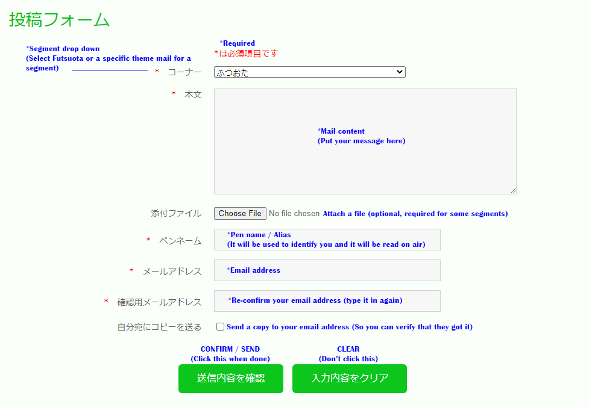
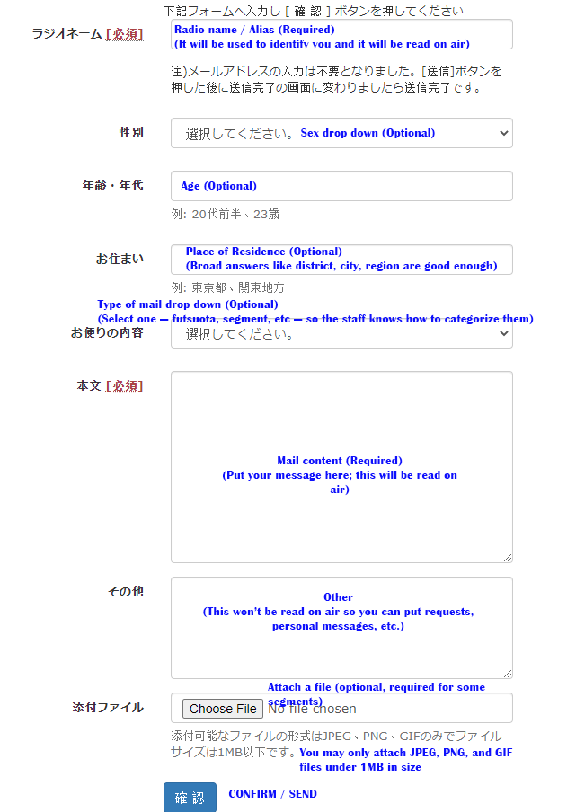
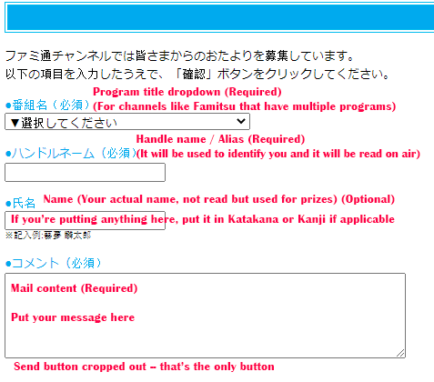
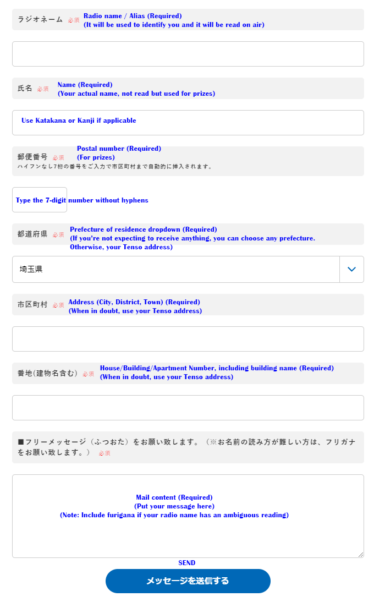
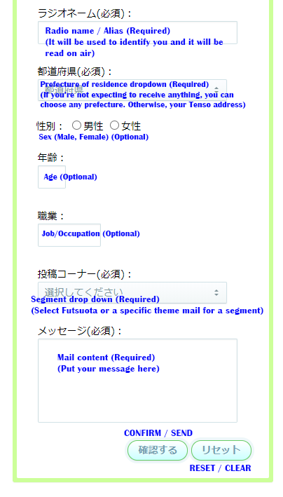

---

Published: 2020-07-20

---

Image credit: Mine

Welcome! I assume you’ve fallen into what’s probably the most popular and accessible part of overseas _seiyuu_ fandom — _bangumi_ (or programs and shows, which will be used interchangeably). There are several types out there: weekly or monthly, one-offs or episodic, 25 minutes to 3 hours, pre-recorded or live streamed, audio-only or with video, sponsored or non-sponsored, solo to pair to group, cooking to karaoke sessions to travelogues, etc.

While these shows showcase the personalities and guests for entertainment purposes, with countless funny clips and interesting anecdotes of your favorite seiyuu easily found (and fan translated) on the internet, it is also a platform for them to actively promote their work, stay visible to the public, and interact with their fans. Normally, fans can participate in this interaction through comments (SNS hashtags, and live comments via NicoNico and YouTube Live) or by sending mail (or _otayori;_ お便り), the latter of which will be tackled in detail here.  
  
This article serves as a primer to those interested in sending mail to these shows, especially if you wish them to get read on air. It focuses on emails, though most of it should still apply to physical mail. Likewise, while this is framed around _seiyuu_ bangumi, it should also apply to most other kinds as they’re staffed by pretty much the same people. It covers the basics of writing and sending them — what, where, when, and how — and best practices that give you the most chances of getting read on air. The information primarily comes from a director who handles these programs, but also includes my personal insight as I’ve gotten my mail read several times to get an idea of what works and what’s possible. However, this will not cover Japanese composition, as in writing the actual content of the mail; it’s too big of a big topic to discuss here. Examples are mine that got read but there are much better ones out there in your favorite shows. Glossary and references are found at the end.

Hopefully this encourages you to give it a shot because it is a fun activity to practice your Japanese skills with. And getting your mail read out of many, many others, by your favorite _seiyuu_ no less, is something to be proud of.

* * *

**Quick jump links:**  
[Where to send mail and how?](#where-and-how-to-send)  
[When to send mail?](#when-to-send)  
[Types of mail](#types-of-mail)  
[Mail content](#mail-content)  
[How to get read?](#how-to-get-read-on-air)  
[Worth mentioning](#other-points-worth-mentioning)  
[Examples](#examples)  
[Conclusion and references](#conclusion-and-references)  
[Glossary of terms](#glossary)  
[Comment Archive](#comment-archive)

* * *

# Where and How to Send

There are three ways for a program to receive mail:  
  
**Physically via postcards or _hagaki_ (葉書)**  
This option isn’t always available but for those that do, you’ll find the address and recipient details on the program webpage. This was how programs used to receive mail but it is now mostly replaced by electronic methods.

**Email**  
You can find a program’s email address at their webpage, blog posts, or social media account/s. Sending via email is preferable than postcards because it’s easier to use, easier to organize on their end, and it arrives instantly, which guarantees that it actually gets received in a timely manner.

There are restrictions and a prescribed format to emails, but writing on any email program will do. You don’t need to create a file and attach it to the mail, simply type it in

**Form templates**  
This is the most common method because it’s by far the easiest one. You don’t have to worry about the format; you just type in the required information and you’re set. That said, there are many kinds of templates out there, with different requirements and fields to fill out. Below are the examples of them from various programs and stations with translations.

Form templates for Onsen, Hibiki, Famitsu (Nico), Nack5 Fm, Haikyuu! Radio, Radio Osaka, and via Google Forms.

  
  

* * *

# When to send

Send it in as soon as possible. If it doesn’t reach the cutoff, they won’t be able to use it even if they want to, though there’s a slim chance they might use it for the next episode. The timing of the cutoff depends on the program.

Pre-recorded programs and episodes have a set deadline to receive mail. That’s because the mail needs to be screened and organized by staff before recording. The deadline for a given episode is provided in their social media or blog posts when they post mail requests, often with a set of themes. Generally it’s a few days to two weeks before the broadcast date, though I’ve seen hours as well.

Live broadcasts basically have no set cutoff. It’s up to the discretion of the staff writer to pick what mail gets read and that can happen as it broadcasts. That is because viewers or listeners may send in mail that contain fresh reactions to something that happened mid-broadcast (usually a goof or some shenanigans) and the staff writer can pick those out to get read on air later on in the show. However, those still need to be screened; that takes time and once the moment passes, that’s it. So ideally, send them in as soon as possible (and be mindful of the format to avoid confusion and mistakes) but even if they don’t get read, this kind of interaction is appreciated by the staff.

For programs that ask for song requests, the deadline is usually a day to a few hours before the broadcast. This allows them to secure the song and prepare the tracks beforehand so it lines up smoothly with the rest of the program. 

In general, sending mail as early as possible is just good practice. It gives you an overall better chance to get read. It also gives you time to resend mail if you want to correct a mistake, which is completely fine for them to receive; just note in the subject line or body that it’s a resend and clearly instruct them not to read the previous one. 

* * *

# Types of Mail

Staff sort mail into different types:

**_Futsuota_** or **Regular mail**  
Essentially, this kind of mail can be about anything but they usually fall along the lines of: messages of support, questions about certain topics, comments and impressions about an event or release related to the personality or guest (_kansō;_ 感想), requests for advice, quirky and funny anecdotes in everyday life. They usually get read at the start of the show to kick things off and/or at the end to wind things down. In that sense, they are considered as their own segment (informally if not officially) where the personality can converse freely with the audience.

**Theme mail** or **Segment mail**  
These follow a theme that should be followed in order to be read during their respective segment. The themes could be like “The happiest day of my life is…,” or “Tell us your biggest heartbreak and we will console you,” or “I want to be scolded for…” They can be for gimmick segments where specific kinds of writing are requested, like poems or lines of dialogue, for the personality to read and/or comment on. To help you out, tips may be provided indicating the kind of writing they would like to receive (ie. “Please describe the day of your biggest heartbreak in detail”).

It can be broken down further but it essentially boils down to these two. Identifying the type of mail is important. You have to indicate it in the content of the mail or pick the appropriate one in a template because it allows the staff to quickly sort them. And the less trouble they have with your mail, the better your chances to get read.

* * *

# Mail Content

This is the most important part of the mail and deserves the most attention. It will be broken down into parts based on the format below.

<table><tbody><tr><td>[Segment]</td></tr><tr><td></td></tr><tr><td>[Place of residence] [Radio name]</td></tr><tr><td></td></tr><tr><td>[Body - Introduction] [Body - Main content]</td></tr><tr><td></td></tr><tr><td>[Other / Postscript / Image attachments]</td></tr><tr><td></td></tr><tr><td>[Contact details]</td></tr></tbody></table>

This won’t apply as much for templates but if you find yourself having to write one from scratch, it is recommended so staff can quickly sift through them. Note that some programs do prescribe formats with different requirements (such as Seiyuu Grand Prix) so make sure to check their social media and blog posts.

* * *

**\[Segment\]**  
Indicate which segment the mail goes to (_futsuota_, a specific segment, etc.).

It essentially functions as a header to help them sort it right away. It should be the first thing they see. This can be omitted if you wrote it in the subject line of the mail.

**\[Place of residence\]**  
Used by mainstream radio shows where they sort then read mail according to region. Optional for anime/_seiyuu_ programs since it’s not usually done there.

Broad place names only (Region, Prefecture, City, Ward, or Town)

It’s completely fine to omit but if you want to include it, make sure it’s above your radio name so they don't mix it up.

**\[Radio name\]**  
Can also be called pen name, handle name, alias, or whatever quirky title the personality gives their audience.

You may indicate this as “ラジオネーム：\[Radio name\]”

Any name is fine, just make sure it’s appropriate to be read in a broadcast.

For sponsored programs, especially anime shows, don’t use the names of their competitors/other anime. They will not be read.

If the name is inappropriate but the content is worth reading, the staff writer might be generous enough to simply change the name to something radio-friendly. It happens but not often.

Keep it short, though the staff writer might pick particularly long, funny ones if they feel like it.

Make it easy to read. They wouldn’t want to guess how your name is read so include furigana for ambiguous kanji.

**\[Body - Introduction\]**  
Start with something quick and casual to give everyone an idea of who you are and your personal connection to the show (“I’m an avid listener!,” “This is how I end my long work day,” “It’s my favorite show!,” etc.) so they know how to respond to it. After introducing yourself, lead into the main content of your letter.

For _kansō_ mail, start by mentioning the thing you will be talking about, which could be the event you attended or the product you bought.

Starting with _hajimemashite!_ (or _hatsu mērū_ \[初メール\] if it really is your first) each time you send mail is fine until you actually get read for the first time. This is because they actually prioritize new senders and they remember those who send to their show.

Don’t be shy to write a witty (or punny) way to say hello. It is very much appreciated as it builds rapport between the personality and the audience, especially if it sticks.

**\[Body - Main content\]**  
Keep it short and concise. A limited amount of time is allocated to reading mail, around 5-15 minutes. Mail that takes longer to read takes away time for other mail and they prefer to read more of them. Time yourself and make sure yours can be read in under a minute — around 15 seconds to read aloud, the rest to comment on it.

Incidentally, this means the actual length of the mail doesn’t matter as much as long as it doesn’t take too long to read. Still, make them as concise as possible. There are cases where longer mail is allowed/requested and those are indicated in the mail requests.

Keep it neat and easy to read. This relates specifically to line breaks. Sometimes staff receive mail that has no line breaks, which leads to the message being cut off short on their end and thus unusable. This happens more often with mail being typed on a smartphone. At best, keep it to 30 - 40 moji (characters) per line.

Get a conversation going. After you pour your heart into the content of the mail, don’t forget to end it with a question to get a good flow of conversation going. Write that you’re curious about something, which can be anything they can talk about after reading your mail. Write about their recent activities or releases and ask them what they thought or felt. This allows them to actually talk about them on the show and say something interesting about it, which is good for everyone. If you don’t have a question to ask, simply mentioning how much you appreciate their recent work is good enough. It also allows them to segue into that topic.

Keep it to a single topic. Not only does this make it short, this allows the personality to focus on that topic. If you really want to mention multiple topics, send each topic as their own mail. The staff is completely fine with it. They’ll simply pick one that seems appropriate, if they decide to.

If they receive multiple mail on the same topic, priority goes to new senders. This allows the staff to mix things and avoid the same people getting read, though it still happens a lot. Sometimes, the staff writer can be accommodating; they will hand over a few mail of the same topic for the personality to read which they would then comment on.

**\[Other / Postscript / Image attachments\]**  
You can write more personal messages in your mail for the personality to read but not on air, if yours got picked. Just make sure to mark it clearly with an instruction like “(ここからは読まないでください) // Please don’t read past this point”. Same goes for putting Postscripts (P.S.) on the mail, otherwise they might read it.

For shows with multiple personalities or guests, you can ask the staff to have a specific person read your mail on air. That may be because you want to see their reaction as they read it or you’re curious as to what they’ll say about it. Just state it clearly and they will honor it. Otherwise, it’ll be up to the staff writer to decide based on what they think will make the most interesting reaction.

For image attachments, check the size and resolution of your file before sending. If the file size is too big (10 - 20 Mb), they might not even be able to open it; this happens more often with images taken with a smartphone. Likewise if the resolution is too big or too small and they can't use it on screen. Video programs broadcast at a maximum 1920 x 1080 resolution (usually 1280 x 720). Incidentally, this means that photos in landscape (horizontal) show up better than in portrait (vertical).

**\[Contact details\]**  
Optional. Only required if you’re expecting to receive a reward or gift, or for phone segments where the personality will call you directly so you can chat with them. Supply the information as required at the end of the mail.

Make sure to include your postal number if you’re writing an address.

**Final note:**  
The bare minimum is \[Radio name\] and \[Body\]. Ideally, you should still include \[Segment\] just to be extra sure but most programs aren’t that strict with the format as long as they can interpret it easily, especially as most of them use a form template nowadays.

* * *

# How to get read on air?

If you just want the personality to read your mail, don’t worry. They do read through all of them. In fact, they make it a point of mentioning that they do and they call out those who send the same mail to multiple programs.

**If you want your mail to get read on air, keep in mind these five points:**

1. The director and staff writer screen and sort the mail. The staff writer picks what gets read. They may even do it during the broadcast.
2. Mail reading segments usually run for 5-15 minutes, though there may be multiple segments per show.
3. Promptness, good readability, and smooth conversation flow gives the most chances to get picked.
4. Being a new sender gives a priority advantage.
5. Indicating that you’re an overseas fan doesn’t matter and avoid sending the same mail to multiple programs (more on those in a later section).

To elaborate:

**The staff and personality always aim to run a great and memorable show.** Mail reading segments contribute a lot to that by giving the personality topics to talk about. Who wouldn’t want to talk about something because someone is curious about it instead of just themselves bringing it up?

**Mail reading segments create a connection between personality and audience.** The best mail are ones that lead into interesting anecdotes and stories about them. All the clips that circulate on the internet came about because some witty and curious sender raised a topic that the staff writer liked enough to hand over to the personality to read and answer. How well the staff knows their personality factors into this; if they know it will get an interesting story or reaction from them, they will push it.

**Make it as easy as possible for them to go through your mail.** Early mail gives a good impression and properly formatted mail (and clearly instructed if you put any) reduces the likelihood of confusion on their end as they go over all of them.

**Keep your composition simple and readable.** It should come across well as written and spoken text. Be mindful of the fact that an audience is also listening to the content of your mail and how that affects the mood of the show. Passable Japanese writing skills are expected. Being a funny and quirky writer is secondary but welcomed.

**Programs run on a limited and strict schedule.** No matter how popular a show is, they only have so much time to read mail. That means if a show receives a lot of mail, you have an overall lower chance to get read just by volume alone, even if your mail is worth reading on air. If you really want to get read, aim for the less popular ones.

Finally, **everyone always appreciates seeing their audience grow.** That’s why new senders are given priority whenever possible. Not only does it give an impression of a healthy program, it also encourages people to send mail. Each show will always have its share of regulars but all of them were once new and were given a chance.

* * *

# Other points worth mentioning

**The overseas (_kaigai;_ 海外) fan card**  
Contrary to popular belief, pointing out that you’re an overseas fan does not hurt nor help your chances in getting picked in a broad sense. Yes, it brings up the topic of foreigners being good at Japanese or the personality having overseas fans, but that’s all that it is — a segue topic. Sometimes that topic doesn’t contribute to the flow of the show so it doesn’t get picked even with its inherent novelty.

However, there are instances where it is beneficial. If the personality recently went overseas, they will most likely pick mail from that region. On birthday episodes, that’s usually a good topic to go with especially that they tend to read lots of mail. You may use the _kaigai_ card as some sort of explanation for the rest of your letter, such as being unable to purchase a recent physical release of theirs because you don’t live in Japan, or being curious about places to go because you’re planning to go there, etc.

One time, my mail got read for a dummy head (binaural mic) segment even though my Japanese definitely sounded off and foreign because the sentiment in it appealed to the staff writer and it was read as is.

**Sending the same mail to multiple programs.**  
Don’t do it. Their policy is to blacklist those that do. You might get your mail read once and that’s it. It may slip through with the amount of programs out there but it’s a small world with staff members running multiple programs. It’s still up the staff to blacklist but it’s better not to take the chance.

**The difference between mail sent to programs and regular fan mail**  
When you send mail to a program, it comes with the expectation that it will be read with an anonymous audience listening to it. Regular fan mail is you conveying your thoughts to someone privately.

Although _kansō_ mail in a program may read like fan mail, it’s talking about a topic everyone — that is, you, the staff, personality, and audience — knows and can relate to. You can’t go deep into personal topics that you probably don’t want others to know, or topics that will just fly over people’s heads. That said, there’s nothing stopping you from writing in that manner. It’s simply unlikely to get picked but rest assured that it will be read off-the-air.

What fan mail can’t do for you is getting a direct response. That’s why some _seiyuu_ encourage sending mail to programs if you have questions so they can actually give an answer.

**Sending in mail with corrections**  
If you messed up and made a mistake for whatever reason (typo, wrong name, missed a keyword for a prize, etc.), feel free to send the mail again. Make sure to indicate that it’s a resend (_saisō_; 再送) and that they should ignore the previous one.

This also applies if you’re sending a completely different mail from the one you originally sent. In that case, you might want to be extra sure and note for them what the contents of the previous one were so they know to avoid it.

**_Keigo_**  
This wasn’t covered at all in my references but it’s pretty well understood that you should stick to politeness if unsure, unless told otherwise. However, you may break _keigo_ for effect, especially for reading segments that ask for poems and dialogue.

* * *

# Examples

There are better examples out there with much better writers but here are mine that got read. They were for different programs: One was during a birthday episode, the other was a theme mail. Some parts are omitted because as awesome as it feels, it is embarrassing. :P

\[This used a template. The top line was the radio name I used and it was not included in the body. I pulled the _kaigai_ card here and it resulted in the topic mentioned above. This also happened to be the first one I ever sent.\]

流暢になりたい  
  
◯ ◯ 、こんばんは。  
そして、お誕生日おめでとう！  
  
実は、私はアメリカのファンなので日本語文章がまだまだですけど、そのきかっけでなにか言いたいと思って。  
  
◯ ◯ はめちゃすごいなぁ。いつかなんでも屋だけではなく、なんでもできるひとになると信じています。素晴らしい作品や演技や歌やステージを期待しています！  
  
これからの「攻める」もいつも、どこでも、全力で応援します！  
  
改めて、お誕生日おめでとう！

\[For the second one, this is the Seiyuu Grand Prix format. Admittedly, much of this is made up and aside from the katakana name, I wanted to avoid pulling the _kaigai_ card. Note the break in _keigo_ for effect. It got a good topic going given the situation at the time, when it was impossible to eat out.\]

お名前：ジェリコ  
  
お住まいの地域：東京   
  
ペンネーム：どなつ（さん）  
  
コーナー名をお書きのうえ： 今回のテーマ「本音を言うと...」  
  
実はこの状況が長く続けているので手料理が飽きるようになります。◯ ◯の料理が大好きで他の事態なら文句言わずに食べて、さらに今でも◯ ◯の料理はどんどん発展しています。けど、いやでも正直いって、外食したい。笑  
  
◯ ◯はそんなことがありますか？

* * *

# Conclusion and References

And.. that’s it! This got longer than I intended but if it inspires you to do it and it raises your chances to get read on air, that makes it all worth it. There really is something to writing letters and getting them read that makes the _bangumi_ experience all that more exciting and engaging. And if you're an overseas fan, this also gives the staff and personality the impression that they do have fans like you trying their best to reach out. So give it a shot!

If you have any more tips and such, feel free to tell me about it (Comments below or [@jbtenmatay](https://twitter.com/jbtenmatay)). The primary references are these videos by バロン大野, affectionately called _i☆Ris Ojisan_ (for those who might know that) because of his role as director of _i☆Ristation!!_ and many more programs and events. There are also mail samples there.

https://www.youtube.com/watch?v=oN5iOqG1aEg

https://www.youtube.com/watch?v=VOj10SBInFQ

* * *

# Glossary

Relevant relevant terms taken from the [Seiyuu Subculture Term Glossary](https://seiyuu.yakuaru.com/) and edited to fit. Romaji is Modified Hepburn for consistency._**

**番組**– _bangumi_. **Program** or **show**. Produced shows that are broadcast for a specific purpose, primarily for entertainment and promotion. It’s a very popular form of media and most seiyuu often find themselves hosting or guesting in one or more shows at any given time because it gets their name and personality out there, while providing an easy way to promote their work and interact with fans.

Differences vary between studios and programs but they’re essentially full productions with a proper staff (director, producer, script writer, etc.) and a channel (チャネル; _chaneru_) that houses the content. They are usually independent in that they broadcast from a platform (such as Onsen, Hibiki, Niconico, A&G) but are not directly affiliated with them. Most broadcast their main content for free, only requiring a subscription to view extra content and archive videos.

**生放送** – _namahōsō_. **Live broadcast of a program**.  As it is aired live, there is no room for edits and all adjustments are done on the fly. It tests the seiyuu’s ability to stick to a script, manage time, and think on their feet if needed. For the viewer, however, it comes with the perk of seeing reactions as comments in real-time and interacting with them is part of the fun, hence why some prefer doing this over pre-recording.

Due to its roots as a TV broadcasting term, _namahōsō_ is a specific term used for programs and radio shows since they are more structured than most live streaming content, and it also sounds more official.

**生配信** – _namahaishin_. **Live streaming over the internet**. It may be used interchangeably with _namahōsō_ due to both of them being live broadcasts. It is a broader term, however, since it covers not just programs but anything that is streamed in real-time on the internet such as gaming streams, festival showcases, concert live streams, tournament streams, etc.

To put into similar context, all content you see streamed live on Twitch, YouTube, Nico Nico, and countless other live streaming services are _namahaishin_. Once the content is not streaming live but is instead viewable as VODs (Video on Demand) or archive streams, they are simply called videos or archives.

**録音放送** – _rokuon-hōsō_. Shows may be broadcast as **pre-recorded** because of scheduling constraints, to fit a timeslot that would be impractical for a live format (such as late night broadcasts), or to satisfy a set monthly schedule (as is the case for channels with multiple shows). While they are usually recorded two or more episodes at a time, some shows do record only one at a time; those shows normally request for mail days, even hours, beforehand.

The difference between live and pre-recorded programs lie in the interactions. There are no comments to react to so it’s mostly up to the scriptwriter to act as the personality’s sounding board and you’ll often hear them in the background as a result. If there is a guest or co-host, the relationship between them tends to become more apparent or exaggerated, especially for radio shows, giving them that supposedly distinct “radio show” feel.

**コーナー** – kōnā. **corner** or **segment**. A seiyuu program tends to follow a standard format where they do some catch-up, read mail, and do announcements. What makes them different from other programs are the segments. These could be anything from live gaming, live reading, Q&A, music appreciation, cooking, lectures, dancing, anything that brings out their personality’s uniqueness. They may be predetermined as part of their promotion but they are always subject to change, and some are simply variety segments where anything goes.

**前半** – _zenhan_. **The former half of a program**. This is where introductions take place and some catching up with the host’s (and the guest and assistant, if present) activities since they last appeared before ending with announcements and reminders of their future activities. Mail might get read and some sponsored segments will be done here but most of them are usually reserved for the latter half.  For shows with a subscription, this is usually the free portion. It’s important to note that a program’s distinctive segments and gimmicks might not show up here.

**後半** – _kōhan_. **The latter half of a program**. Often done with paid shows as its “members-only” content. This portion is more flexible since this is focused on personal interaction with the viewers. Personalities read mail, answer questions, or do cute, cool, and silly stuff during their segments. While technically different from extras (_omake_), some programs consider the latter half as such by calling them _omake-hōsō_ (おまけ放送).

**パーソナリティー**  – _pāsonariti_. **personality** or **host**. Originally a radio broadcasting term, this refers to the star of the show. They carry the show from start to finish, interact with guests, and make things interesting and memorable for the listeners or viewers. 

A program usually features one or two main personalities. If they’re permanent, the title of the show is usually named after them, sometimes in punny ways. For programs with solo personalities, they may invite a temporary co-host or assistant (アシスタント; _ashisutanto_) to spice things up. For those that feature a group, it may be a rotating roster instead, with members taking turns as personality or guest. These shows in particular are interesting to watch because of the dynamics that come with the role and the relationship between the members who appear in it.

**メール // (お)便り**– _mērū_ // _(o)tayori._ Specifically refers to **mail** sent to programs. Used to refer to physical postcards (_hagaki_) for the personality to read but nowadays (and more commonly) refers to email as well. For this article, mail and letter will be used interchangeably.

**ふつおた** – _futsuota_. Short for 普通のお便り (_futsū no otayori_). Refers to **fan mail that aren’t written for a program’s unique segment/s** since those request for mail pertaining to set themes as a way to facilitate interaction (ie. about cooking, embarrassing moments, etc.).

Essentially, this kind of fan mail can be about anything and they usually get read during the start of the show to kick things off and/or at the end to wind things down. In that sense, they are considered as their own segment (informally if not officially) where the personality can converse freely with their audience.

**監督 // ディレクター** – _kantoku_ // _direkutā_. The **director** is the hands-on manager of the set, who also deals with the technical aspects of running a show. They approve the script, plan the overall direction, and give instructions to the personality and staff (some of which may be provided by the station since the core staff tends to be small) during recording from the sound room, though they may also just do it themselves. They also do most of the post-production. An assistant director may also serve under them, however programs with short run times (less than one hour) don’t usually have one. They also screen mail but the final decision goes to the staff writer

**作家** – _sakka_. **writer**. The staff writer writes the script and program guidelines that the personality follows or falls back on if they get stuck. They also screen fan mail and pick what gets read in the show. During recording, they assist the personality as a sort of sounding board, staying with them inside the booth while providing direction, correction and clarification when necessary. They provide valuable feedback especially in solo recordings and pre-recorded shows where there is no live audience to react to. Because of the nature of the role, their presence is often felt since you will usually hear them in the background or hear the personality interact with them. They also come up with the timetable that frames the show.

**聴取者** \- _chōshusha_. Refers to **radio listeners**. Colloquially, you may encounter listener-san (リスナーさん**;** _risunā-san_) instead.

**視聴者** - _shichōsha_. Refers to **viewers**. Colloquially, you may encounter viewer-san (ビューアーさん; _byūā-san_) instead.

* * *

# Comment Archive
**Official SAKU**  
JULY 26, 2020 AT 8:06 PM  
Where do the form templates come from?

&nbsp;&nbsp;&nbsp;&nbsp;**Jerico Tenmatay**  
JULY 26, 2020 AT 8:10 PM  
They’re from various radio shows and stations (Onsen, Hibiki, Famitsu (Nico), Nack5 Fm, Haikyuu! Radio, Radiko). One of them is done via Google Forms.

Actually, I was meaning to do it but I neglected renaming the files so you’d know right away from the filename. So I’ll do just that.

Edit: Done. Also reordered them to make them less confusing.

**Official SAKU**  
JULY 26, 2020 AT 9:14 PM  
Thank you!!! Was it a certain website that you got them from or did you make them all?

&nbsp;&nbsp;&nbsp;&nbsp;**Jerico Tenmatay**  
JULY 26, 2020 AT 9:22 PM  
No problem! I made them myself, if the screenshots + translations are what you meant, but you can find them very easily in their respective pages. Some of them in plain sight. Some have helpful mail envelope images to lead you. Some you might need to dig a bit more to find since it is expected that you can read Japanese.

**Official SAKU**  
AUGUST 8, 2020 AT 2:20 AM  
Are there any more websites that have the templates?

&nbsp;&nbsp;&nbsp;&nbsp;**Jerico Tenmatay**  
AUGUST 8, 2020 AT 2:23 AM  
There definitely are more out there but those are the most common ones. Actually, I included some uncommon ones to illustrate the point that they all kind of look the same. Once you’ve seen a few of them, you can pretty much navigate through all of them with little issue.

**Jen A.**  
JANUARY 24, 2021 AT 5:26 AM  
Can they translate an English fan mail into Japanese?

&nbsp;&nbsp;&nbsp;&nbsp;**Jerico Tenmatay**  
JANUARY 24, 2021 AT 11:15 AM  
As far as I know, they don’t. Not only is it another hurdle to see if the mail is broadcast-friendly, you’d be asking the staff to go the extra mile, and I honestly think none of them can do it. Machine translation (Google Translate, DeepL, etc.) are crutches at best and you’d rather not have your mail be misunderstood with a mistranslation. Imagine that happening the other way around with Japanese to English fan mail.

The only exception I could think of is if the personality knows English (or knows it well enough to read it) and is asking for English fan mail that they can read on air… which could be a great idea, a hilarious disaster, or both.

**Anamika**  
MARCH 4, 2021 AT 5:19 AM  
Could you please give me the radiko’s form template link?

&nbsp;&nbsp;&nbsp;&nbsp;**Jerico Tenmatay**  
MARCH 4, 2021 AT 8:22 AM  
Sorry, I was inaccurate with referring to radiko here specifically (I’ll edit it shortly). It’s from Radio Osaka, which can be heard from radiko. Here’s the link leading to the templates. Just pick any of them under Eメール. http://www.obc1314.co.jp/message_all.html
